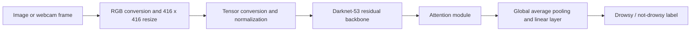

# Driver Drowsiness Detection

A computer-vision prototype implemented by **Pathlavath Shiva Kumar** using PyTorch and OpenCV. It classifies images or webcam frames as **drowsy** or **not drowsy**.

## Implementation

- A Darknet-53 backbone with convolutional and residual blocks.
- An attention module followed by global average pooling and a two-class linear output.
- `torchvision` preprocessing and training/validation workflows.
- Still-image prediction and Grad-CAM exploration.
- OpenCV webcam capture with an on-screen prediction label, plus a video notebook.

The class is named `AttentionYOLOv3` in the notebooks, but the implemented output is an **image classifier**, not a bounding-box detector.

## Architecture



**Stack:** Python, PyTorch, torchvision, OpenCV, Pillow, NumPy, Matplotlib and Jupyter/Google Colab.

## Notebooks

- `nthuddd.ipynb`: dataset preparation, model definition, training and validation.
- `predict.ipynb`: image inference and Grad-CAM visualization.
- `liveprediction.ipynb`: local webcam inference.
- `predictvideo.ipynb`: video inference workflow.

## Setup and usage

```bash
git clone https://github.com/shivakumar9121/driver-drowsiness-dectection.git
cd driver-drowsiness-dectection
python -m venv .venv
# Windows: .venv\Scripts\activate
# macOS/Linux: source .venv/bin/activate
pip install torch torchvision opencv-python pillow numpy matplotlib tqdm jupyter
jupyter notebook
```

Choose the appropriate PyTorch build for your hardware. The training and image notebooks contain Google Colab-specific upload commands and `/content/` paths; run them in Colab or adapt those paths for your machine. Kaggle dataset downloads require the Kaggle client and credentials belonging to your own account.

For webcam inference, place the matching `attention_yolov3_drowsy_8epochs.pth` checkpoint beside `liveprediction.ipynb`, run its cells in order on a machine with a webcam, and press **q** to close the video window. Confirm that the inference class order matches the training dataset's `class_to_idx` mapping.

## Existing downloadable artifacts

The original project links are preserved below. The external Android artifact is separate from the Python implementation inspected in this repository.

- [Model files](https://drive.google.com/drive/folders/18d4T8gfPNV7N1JXf2Lzlam1urjqJqSqD?usp=drive_link)
- [Android application artifact](https://drive.google.com/drive/folders/12PuIfinPP-e-cnJPVsTy-i4mfxD-D4hL?usp=drive_link)

## Results and limitations

The notebooks implement training, validation and inference; no independently verified accuracy, real-world safety result or production deployment is claimed. The training notebook currently shares augmented transforms between the randomly split training and validation subsets. A future evaluation should use deterministic validation transforms and a separate subject-aware test set.

This is an academic prototype, not a validated driver-safety system. Relevant next steps include subject-independent evaluation, lighting/occlusion tests, temporal smoothing and reproducible environment instructions.

## Credential handling

Keep `kaggle.json` and environment secrets local. Upload return values are assigned so file contents are not automatically echoed. Clear notebook outputs before publishing. If a credential has ever been exposed, its account owner must revoke it; deleting notebook output does not invalidate older copies.

